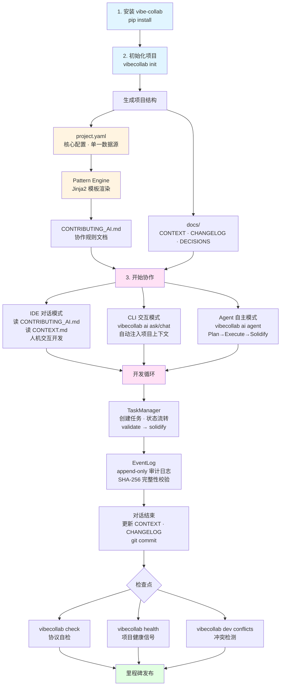
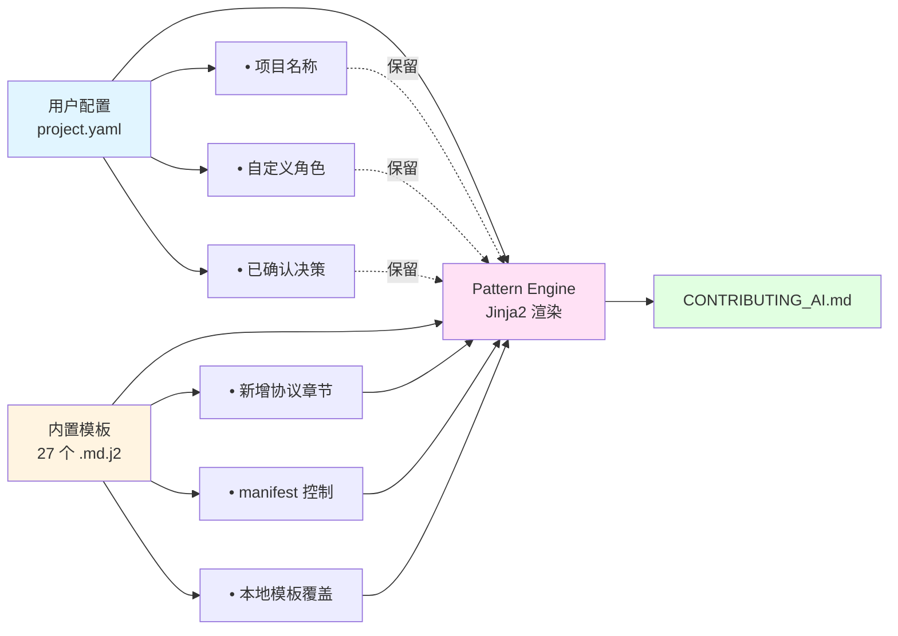

# VibeCollab

[](https://badge.fury.io/py/vibe-collab)
[](https://www.python.org/downloads/)
[](https://opensource.org/licenses/MIT)

**从 YAML 配置生成标准化的 AI 协作协议，支持多开发者/多 Agent 协同开发**

将 Vibe Development 哲学和 LLM 协作协议抽象为可配置、可复用的框架，支持快速在不同领域部署工程化的人机协作流程。支持多开发者独立上下文管理、CLI 身份切换、跨开发者冲突检测等特性。

> 本项目自身也使用生成的协作规则进行开发（元实现），并支持与 [llmstxt.org](https://llmstxt.org) 标准无缝集成

---

## 工作流程图



---

## 特性

- **Pattern Engine** (v0.5.9+): Jinja2 模板驱动的 CONTRIBUTING_AI.md 生成，27 个 `.md.j2` 模板 + manifest 控制
- **Template Overlay** (v0.5.9+): `.vibecollab/patterns/` 本地模板覆盖，支持章节增删改
- **三模式 AI CLI** (v0.5.8+): `vibecollab ai ask/chat` 人机交互 + `vibecollab ai agent` 自主模式
- **Agent Executor** (v0.5.9+): LLM 计划 → 文件变更 → 测试 → git commit，含安全门控
- **Health Signals** (v0.5.9+): 项目健康评分 (0-100 + A/B/C/D/F)，10+ 信号类型
- **LLM 客户端** (v0.5.7+): Provider-agnostic (OpenAI-compatible + Anthropic Claude)
- **任务生命周期** (v0.5.6+): validate→solidify→rollback 状态管理
- **审计日志** (v0.5.5+): Append-only JSONL EventLog，SHA-256 完整性校验
- **多开发者支持** (v0.5.0+): 多人/多 Agent 协同开发，独立上下文管理
- **冲突检测** (v0.5.1+): 自动检测跨开发者的文件冲突、任务冲突、依赖冲突
- **协议自检** (v0.5.2+): 检查协议遵循情况，确保文档及时更新
- **CI/CD 自动发布** (v0.6.1+): GitHub Release 触发自动 PyPI 发布
- **领域扩展**: 支持 game/web/data 等领域的定制扩展
- **自举实现**: 本项目使用自身生成的协作协议进行开发

---

## 安装

```bash
pip install vibe-collab
```

或从源码安装：

```bash
git clone https://github.com/flashpoint493/VibeCollab.git
cd VibeCollab
pip install -e .
```

---

## 快速开始

### 初始化新项目

```bash
# 通用项目
vibecollab init -n "MyProject" -d generic -o ./my-project

# 多开发者模式项目
vibecollab init -n "MyProject" -d generic -o ./my-project --multi-dev

# 游戏项目（含 GM 命令注入）
vibecollab init -n "MyGame" -d game -o ./my-game

# Web 项目（含 API 文档注入）
vibecollab init -n "MyWebApp" -d web -o ./my-webapp

# 数据项目（含数据处理流程）
vibecollab init -n "MyDataProject" -d data -o ./my-data-project
```

### 生成的项目结构

#### 单开发者模式（默认）

```
my-project/
├── CONTRIBUTING_AI.md         # AI 协作规则文档
├── llms.txt                   # 项目上下文文档（已集成协作规则引用）
├── project.yaml                # 项目配置 (可编辑)
└── docs/
    ├── CONTEXT.md              # 当前上下文 (每次对话更新)
    ├── DECISIONS.md            # 决策记录
    ├── CHANGELOG.md            # 变更日志
    ├── ROADMAP.md              # 路线图 + 迭代建议池
    └── QA_TEST_CASES.md        # 产品QA测试用例
```

#### 多开发者模式（`--multi-dev`）

```
my-project/
├── CONTRIBUTING_AI.md
├── llms.txt
├── project.yaml
└── docs/
    ├── CONTEXT.md              # 全局聚合视图（自动生成，只读）
    ├── CHANGELOG.md            # 全局变更日志
    ├── DECISIONS.md            # 全局决策记录
    ├── ROADMAP.md
    ├── QA_TEST_CASES.md
    └── developers/             # 开发者工作空间
        ├── COLLABORATION.md    # 协作关系文档
        ├── alice/              # 开发者 alice 的目录
        │   ├── CONTEXT.md      # alice 的工作上下文
        │   └── .metadata.yaml  # 元数据
        └── bob/                # 开发者 bob 的目录
            ├── CONTEXT.md
            └── .metadata.yaml
```

> **💡 llms.txt 集成**：工具会自动检测项目中是否已有 `llms.txt` 文件。如果存在，会在其中添加 AI Collaboration 章节引用协作规则；如果不存在，会创建一个符合 [llmstxt.org](https://llmstxt.org) 标准的 `llms.txt` 文件。

### 文档体系说明

项目初始化后会生成一套完整的文档体系，每个文档都有明确的用途和更新时机：

#### 关键文件职责

| 文件 | 职责 | 更新时机 |
|-----|------|---------|
| `CONTRIBUTING_AI.md` | AI 协作规则，顶层指导 | 协作方式演进时 |
| `llms.txt` | 项目上下文摘要 (llmstxt.org 标准) | 项目信息变更时 |
| `docs/CONTEXT.md` | 当前开发上下文 | 每次对话结束时 |
| `docs/DECISIONS.md` | 重要决策记录 | 每次 S/A 级决策后 |
| `docs/CHANGELOG.md` | 版本变更日志 | 每次有效对话后 |
| `docs/QA_TEST_CASES.md` | 产品QA测试用例 | 每个功能完成时 |
| `docs/PRD.md` | 产品需求文档 | 需求变更时 |
| `docs/ROADMAP.md` | 路线图+迭代建议 | 里程碑规划/反馈时 |

**多开发者模式额外文件**：

| 文件 | 职责 | 更新时机 |
|-----|------|---------|
| `docs/developers/COLLABORATION.md` | 团队协作关系和任务分配 | 任务分配/交接时 |
| `docs/developers/{dev_id}/CONTEXT.md` | 开发者个人工作上下文 | 每次对话结束时 |
| `docs/developers/{dev_id}/.metadata.yaml` | 开发者元数据（角色、专长等） | 角色变更时 |

> **⚠️ 上下文保存协议**: 每次对话结束时，AI 应：
> 1. 更新 `docs/CONTEXT.md` 保存当前状态
> 2. 更新 `docs/CHANGELOG.md` 记录本次产出
> 3. 如有新决策，更新 `docs/DECISIONS.md`
> 4. **必须执行 git commit** 记录本次对话产出

#### 📄 `CONTRIBUTING_AI.md` - AI 协作规则文档
- **用途**: 项目的顶层协作规则，定义 AI 与开发者的协作方式
- **内容**: 包含核心理念、角色定义、决策分级、流程协议等完整协议
- **更新时机**: 当协作方式演进时（通过 `vibecollab generate` 重新生成）
- **特点**: 由 `project.yaml` 配置自动生成，是 AI 理解项目规则的主要依据
- **与 llms.txt 的关系**: 在 `llms.txt` 中通过引用链接指向此文档

#### 📄 `llms.txt` - 项目上下文文档（可选）
- **用途**: 符合 [llmstxt.org](https://llmstxt.org) 标准的项目上下文文档
- **内容**: 项目概述、快速开始、文档索引等
- **生成方式**: 
  - 如果项目已存在 `llms.txt`，工具会自动在其中添加 AI Collaboration 章节引用
  - 如果不存在，工具会创建一个新的 `llms.txt` 文件
- **特点**: 与 `CONTRIBUTING_AI.md` 互补，前者描述"项目是什么"，后者定义"如何协作"

#### 📝 `docs/CONTEXT.md` - 当前开发上下文
- **用途**: 记录当前开发进度、正在进行的工作、待解决的问题
- **内容**: 
  - 当前任务状态
  - 最近完成的工作
  - 下一步计划
  - 技术债务和已知问题
- **更新时机**: **每次对话结束时必须更新**
- **重要性**: ⭐ AI 在对话开始时必须读取此文件以恢复上下文

#### 📋 `docs/DECISIONS.md` - 重要决策记录
- **用途**: 记录所有 S/A 级重要决策，形成项目决策历史
- **内容格式**:
  ```markdown
  ## DECISION-001: 技术框架选择
  - **等级**: A
  - **角色**: [ARCH]
  - **问题**: 选择前端框架
  - **决策**: React + TypeScript
  - **理由**: 团队熟悉，生态完善
  - **日期**: 2026-01-20
  - **状态**: CONFIRMED
  ```
- **更新时机**: 每次 S/A 级决策确认后
- **价值**: 为后续决策提供参考，避免重复讨论

#### 📊 `docs/CHANGELOG.md` - 版本变更日志
- **用途**: 记录每次对话的产出和变更
- **内容**: 
  - 新增功能
  - Bug 修复
  - 配置变更
  - 文档更新
- **更新时机**: **每次有效对话后**
- **格式**: 遵循 [Keep a Changelog](https://keepachangelog.com/) 规范

#### 🗺️ `docs/ROADMAP.md` - 路线图与迭代建议池
- **用途**: 规划项目里程碑和收集迭代建议
- **内容结构**:
  - **路线图**: 当前里程碑计划
  - **迭代建议池**: QA/用户反馈的功能建议
    - ✅ 纳入当前里程碑
    - ⏳ 延后到下个里程碑
    - ❌ 拒绝（不符合方向）
    - 🔄 合并其他迭代
- **更新时机**: 里程碑规划时、收到反馈时
- **价值**: 帮助 PM 管理需求优先级

#### ✅ `docs/QA_TEST_CASES.md` - 产品QA测试用例
- **用途**: 从用户视角编写的功能验收测试用例
- **内容格式**:
  ```markdown
  ## TC-MODULE-001: 用户登录功能
  - **功能**: 用户登录
  - **前置条件**: 用户已注册
  - **测试步骤**:
    1. 打开登录页面
    2. 输入用户名和密码
    3. 点击登录按钮
  - **预期结果**: 登录成功，跳转到主页
  - **状态**: 🟢 PASS
  ```
- **更新时机**: 每个功能完成时
- **特点**: 与单元测试互补，关注功能完整性而非代码正确性

#### ⚙️ `project.yaml` - 项目配置文件
- **用途**: 项目的核心配置文件，定义所有协作规则
- **内容**: 
  - 项目基本信息
  - 角色定义
  - 决策分级
  - 任务单元配置
  - 对话流程协议
  - 测试体系配置
  - 里程碑定义
  - 领域扩展配置
- **更新时机**: 需要调整协作规则时
- **特点**: 修改后通过 `vibecollab generate` 重新生成 `CONTRIBUTING_AI.md`

### 自定义后重新生成

```bash
# 编辑 project.yaml 后重新生成（默认输出 CONTRIBUTING_AI.md 并集成 llms.txt）
vibecollab generate -c project.yaml

# 指定输出文件
vibecollab generate -c project.yaml -o CONTRIBUTING_AI.md

# 不集成 llms.txt
vibecollab generate -c project.yaml --no-llmstxt

# 验证配置
vibecollab validate -c project.yaml
```

---

## 生成的 CONTRIBUTING_AI.md 包含章节

> 由 Pattern Engine 通过 `manifest.yaml` 控制，27 个 Jinja2 模板按序渲染

| 章节 | 说明 |
|------|------|
| 核心理念 | Vibe Development 哲学、决策质量观 |
| 职能角色定义 | 可自定义的角色体系 (DESIGN/ARCH/DEV/PM/QA/TEST) |
| 决策分级制度 | S/A/B/C 四级决策及 Review 要求 |
| 开发流程协议 | 对话开始/结束时的强制流程 |
| 需求澄清协议 | 模糊需求 → 结构化描述转化 |
| 任务单元管理 | 对话任务单元定义、状态流转、依赖管理 |
| 迭代建议管理协议 | QA 建议 → PM 评审 → 纳入/延后/拒绝 |
| QA 验收协议 | 测试用例要素、快速验收模板 |
| Git 协作规范 | 分支策略、Commit 前缀 |
| 测试体系 | Unit Test + Product QA 双轨 |
| 里程碑定义 | 生命周期、Bug 优先级 |
| Prompt 工程最佳实践 | 有效提问模板、高价值引导词 |
| 多开发者协作协议 | 身份识别、上下文管理、冲突检测 (条件渲染) |
| 符号学标注系统 | 统一的状态/优先级符号 |
| 协议自检 | 触发词、检查项 |
| PRD 管理 | 需求文档管理协议 |

> 支持 **Template Overlay**：在项目 `.vibecollab/patterns/` 中放置自定义模板可覆盖内置章节

---

## CLI 命令

```bash
vibecollab --help                              # 查看帮助
vibecollab --version                           # 查看版本
vibecollab init -n <name> -d <domain> -o <dir> # 初始化项目
vibecollab init ... --multi-dev                # 初始化多开发者项目
vibecollab generate -c <config> -o <output>    # 生成协作规则文档（默认集成 llms.txt）
vibecollab validate -c <config>                # 验证配置
vibecollab upgrade                             # 升级协议到最新版本
vibecollab domains                             # 列出支持的领域
vibecollab templates                           # 列出可用模板

# 多开发者命令 (v0.5.0+)
vibecollab dev whoami                          # 查看当前开发者身份
vibecollab dev list                            # 列出所有开发者
vibecollab dev status <developer>              # 查看开发者状态
vibecollab dev sync                            # 同步上下文
vibecollab dev sync --aggregate                # 重新生成全局聚合
vibecollab dev init --developer <name>         # 初始化新开发者

# 开发者身份切换 (v0.5.4+)
vibecollab dev switch <developer>              # 切换到指定开发者
vibecollab dev switch                          # 交互式选择开发者
vibecollab dev switch --clear                  # 清除切换，恢复默认识别

# 冲突检测 (v0.5.1+)
vibecollab dev conflicts                       # 检测跨开发者冲突
vibecollab dev conflicts -v                    # 显示详细冲突信息
vibecollab dev conflicts --between alice bob   # 检测特定开发者间冲突

# 协议自检 (v0.5.2+)
vibecollab check                               # 检查协议遵循情况
vibecollab check --verbose                     # 显示详细检查报告

# 项目健康信号 (v0.5.9+)
vibecollab health                              # 项目健康评分 (0-100)
vibecollab health --json                       # JSON 格式输出

# Pattern Engine (v0.5.9+)
vibecollab patterns                            # 列出所有章节模板及来源

# AI 人机交互 (v0.5.8+)
vibecollab ai ask "问题"                       # 单轮 AI 提问 (自动注入项目上下文)
vibecollab ai ask "问题" --no-context          # 不注入项目上下文
vibecollab ai chat                             # 多轮对话模式

# Agent 自主模式 (v0.5.8+)
vibecollab ai agent plan                       # 只读分析，生成行动计划
vibecollab ai agent run                        # 单次 Plan→Execute→Solidify 周期
vibecollab ai agent run --dry-run              # 干运行，只输出计划不执行
vibecollab ai agent serve -n 50                # 长运行 Agent 服务
vibecollab ai agent status                     # 查看 Agent 运行状态
```

---

## 协议版本升级

当 vibecollab 包有新版本时，已有项目可以无缝升级：

```bash
# 升级当前项目的协议
pip install --upgrade vibe-collab
cd your-project
vibecollab upgrade

# 预览变更（不实际修改）
vibecollab upgrade --dry-run

# 指定配置文件
vibecollab upgrade -c project.yaml
```

**升级原理**：



**保留的用户配置**：
- `project.name`, `project.version`, `project.domain`
- `roles` - 自定义角色体系
- `confirmed_decisions` - 已确认的决策记录
- `domain_extensions` - 领域扩展配置

---

## 核心概念

### Vibe Development 哲学

> **最珍贵的是对话过程本身，不追求直接出结果，而是步步为营共同规划。**

- AI 不是执行者，而是**协作伙伴**
- 不急于产出代码，先**对齐理解**
- 每个决策都是**共同思考**的结果
- 对话本身就是**设计过程**的一部分

### 任务单元 (Task Unit) ⭐

> **开发不按日期，按对话任务单元推进**

任务单元是项目管理的核心概念，每个任务单元代表一次完整的对话协作周期：

```
任务单元 (Task Unit):
├── ID: TASK-{role}-{seq}      # 如 TASK-DEV-001
├── role: DESIGN/ARCH/DEV/PM/QA/TEST
├── feature: {关联的功能模块}
├── dependencies: {依赖的任务ID}
├── output: {预期输出}
├── status: TODO / IN_PROGRESS / REVIEW / DONE
└── dialogue_rounds: {完成所需的对话轮数}
```

**任务单元的优势**：
- ✅ **对话驱动**：以对话为单位推进，而非时间线
- ✅ **状态清晰**：每个任务都有明确的状态流转
- ✅ **依赖管理**：支持任务间的依赖关系
- ✅ **可追溯**：每个任务单元都有完整的对话历史

**使用场景**：
- 开始新功能开发时，创建 `TASK-DEV-001`
- 需要架构决策时，创建 `TASK-ARCH-001`
- QA 验收时，创建 `TASK-QA-001`

### 决策分级制度

| 等级 | 类型 | 影响范围 | Review 要求 |
|-----|------|---------|------------|
| **S** | 战略决策 | 整体方向 | 必须人工确认 |
| **A** | 架构决策 | 系统设计 | 人工 Review |
| **B** | 实现决策 | 具体方案 | 可快速确认 |
| **C** | 细节决策 | 参数命名 | AI 自主决策 |

### 双轨测试体系

| 维度 | Unit Test | Product QA |
|------|-----------|------------|
| 视角 | 开发者 | 用户 |
| 目标 | 代码正确性 | 功能完整性 |
| 粒度 | 函数/模块级 | 功能/流程级 |
| 执行 | 自动化 | 可自动+人工 |

---

## 扩展机制

> **扩展 = 流程钩子 + 上下文注入 + 引用文档**

```yaml
domain_extensions:
  game:
    hooks:
      - trigger: "qa.list_test_cases"
        action: "inject_context"
        context_id: "gm_commands"
        condition: "files.exists('docs/GM_COMMANDS.md')"
    
    contexts:
      gm_commands:
        type: "reference"
        source: "docs/GM_COMMANDS.md"
```

### 钩子触发点

| 触发点 | 时机 |
|-------|------|
| `dialogue.start` | 对话开始 |
| `dialogue.end` | 对话结束 |
| `qa.list_test_cases` | QA 列测试用例 |
| `dev.feature_complete` | 功能完成 |
| `build.pre` / `build.post` | 构建前后 |

### 上下文类型

| 类型 | 说明 |
|-----|------|
| `reference` | 引用外部文档 |
| `template` | 内联模板 |
| `computed` | 动态计算 |
| `file_list` | 文件列表 |

---

## Cursor Skill 使用

本项目包含 Cursor IDE Skill，位于 `.cursor/skills/vibecollab/`：

```bash
# 复制到你的项目
cp -r .cursor/skills/vibecollab your-project/.cursor/skills/

# 或解压 dist/vibecollab-skill.zip
```

Skill 会在对话中自动：
1. 读取 CONTRIBUTING_AI.md 和 CONTEXT.md 恢复上下文
2. 遵循决策分级制度
3. 对话结束时更新文档并 git commit

---

## 工作流程

### 开始新对话

```
继续项目开发。
请先读取 CONTRIBUTING_AI.md 和 docs/CONTEXT.md 恢复上下文。
本次对话目标: {你的目标}
```

### 结束对话（必须）

```
请更新 docs/CONTEXT.md 保存当前进度。
更新 docs/CHANGELOG.md 记录产出。
然后 git commit 记录本次对话。
```

### Vibe Check

```
在继续之前，确认一下：
- 我们对齐理解了吗？
- 这个方向对吗？
- 有什么我没考虑到的？
```

---

## 项目结构

```
VibeCollab/
├── CONTRIBUTING_AI.md           # 本项目的协作规则（自举）
├── project.yaml                 # 本项目的配置（单一数据源）
├── pyproject.toml               # 包配置
├── src/vibecollab/
│   ├── cli.py                   # CLI 主入口
│   ├── cli_ai.py                # AI CLI 命令 (ask/chat/agent)
│   ├── cli_lifecycle.py         # 项目生涯管理命令
│   ├── pattern_engine.py        # Jinja2 Pattern Engine (manifest 驱动)
│   ├── generator.py             # 文档生成器 (粘合层)
│   ├── extension.py             # 扩展处理器
│   ├── project.py               # 项目管理
│   ├── developer.py             # 多开发者管理
│   ├── conflict_detector.py     # 冲突检测
│   ├── llm_client.py            # LLM 客户端 (OpenAI/Anthropic)
│   ├── agent_executor.py        # Agent 执行器 (Plan→Execute→Solidify)
│   ├── event_log.py             # 审计日志 (JSONL + SHA-256)
│   ├── task_manager.py          # 任务生命周期管理
│   ├── health.py                # 项目健康信号提取
│   ├── protocol_checker.py      # 协议自检
│   ├── prd_manager.py           # PRD 需求管理
│   ├── templates.py             # 模板管理
│   ├── templates/
│   │   ├── default.project.yaml
│   │   └── domains/             # 领域扩展
│   └── patterns/                # Jinja2 模板 (.md.j2)
│       ├── manifest.yaml        # 章节清单 + 渲染条件
│       └── *.md.j2              # 27 个章节模板
├── schema/
│   ├── project.schema.yaml      # 项目配置 Schema
│   └── extension.schema.yaml    # 扩展机制 Schema
├── .github/workflows/
│   ├── ci.yml                   # CI: 测试 + lint + 构建
│   └── publish.yml              # CD: Release → PyPI 自动发布
├── docs/
│   ├── CONTEXT.md
│   ├── CHANGELOG.md
│   └── DECISIONS.md
└── tests/                       # 359 tests
```

---

## 开发

```bash
# 安装开发依赖
pip install -e ".[dev,llm]"

# 运行测试
pytest

# Lint 检查
ruff check src/vibecollab/ tests/

# 重新生成本项目的协作规则文档
vibecollab generate -c project.yaml

# 检查协议遵循情况
vibecollab check

# 查看项目健康信号
vibecollab health
```

---

## 版本历史

| 版本 | 日期 | 主要特性 |
|------|------|---------|
| v0.6.1 | 2026-02-24 | CI/CD 自动发布 (GitHub Release → PyPI) |
| v0.6.0 | 2026-02-24 | 测试覆盖率 58%→68%，冲突检测 + PRD 管理全覆盖 |
| v0.5.9 | 2026-02-24 | Pattern Engine + Template Overlay + Health Signals + Agent Executor |
| v0.5.8 | 2026-02-24 | 三模式 AI CLI (ask/chat/agent) + 安全门控 |
| v0.5.7 | 2026-02-24 | LLM Client — Provider-agnostic (OpenAI + Anthropic) |
| v0.5.6 | 2026-02-24 | TaskManager — validate-solidify-rollback 生命周期 |
| v0.5.5 | 2026-02-24 | EventLog — append-only JSONL 审计日志 |
| v0.5.4 | 2026-02-24 | CLI 开发者切换 (`vibecollab dev switch`) |
| v0.5.1 | 2026-02-10 | 跨开发者冲突检测 |
| v0.5.0 | 2026-02-10 | 多开发者/多 Agent 协同支持 |
| v0.4.3 | 2026-02-09 | Windows 编码问题修复 |
| v0.4.2 | 2026-01-21 | 协议自检机制、PRD 文档管理 |
| v0.4.0 | 2026-01-21 | Git 检查和初始化、项目生涯管理 |
| v0.3.0 | 2026-01-20 | llms.txt 标准集成 |

详细变更日志请查看 [docs/CHANGELOG.md](docs/CHANGELOG.md)

---

## License

MIT

---

*本框架源自游戏开发实践，用协作协议来开发协作协议生成器。*
