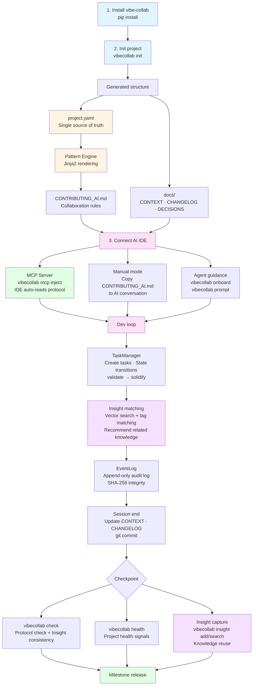
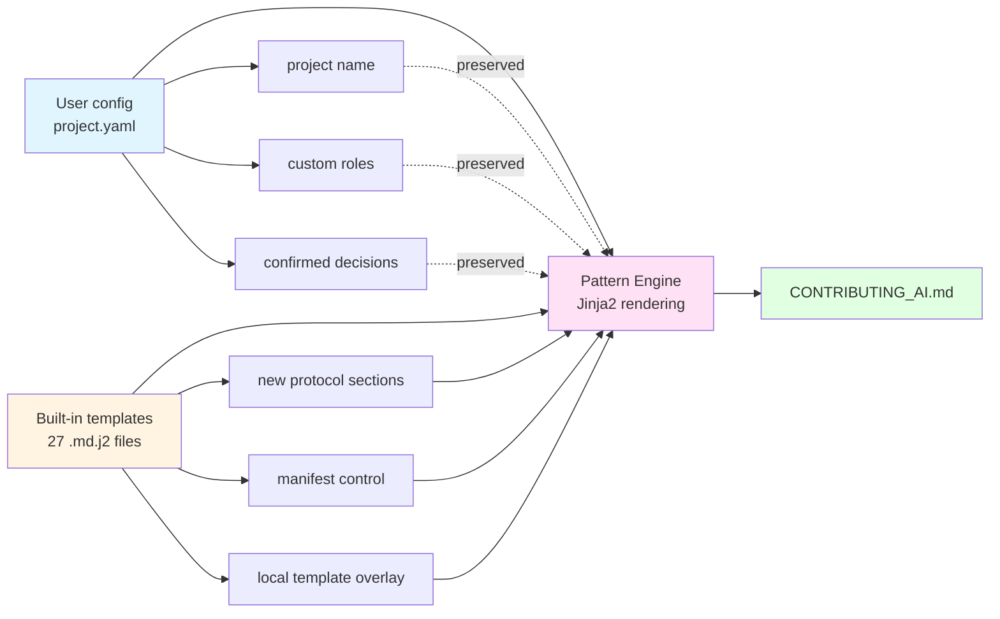

# VibeCollab

[](https://badge.fury.io/py/vibe-collab)
[](https://www.python.org/downloads/)
[](https://opensource.org/licenses/MIT)

**[English](README.md)** | [中文文档](README.zh-CN.md)

---

- **What it is**: A configurable AI collaboration protocol framework with built-in knowledge capture (Insight) and MCP Server.
- **Pain it solves**: Turns chaotic AI-assisted development into structured, auditable, and reusable collaboration workflows.
- **Use in 60 seconds**: `pip install vibe-collab && vibecollab init -n MyProject -d generic -o ./my-project`

---

## Try It Now

```bash
pip install vibe-collab
vibecollab init -n "MyProject" -d generic -o ./my-project
cd my-project

# Connect to your AI IDE (Cursor / Cline / CodeBuddy)
pip install vibe-collab[mcp]
vibecollab mcp inject --ide cursor   # or: cline / codebuddy / all
```

That's it. Your AI assistant now follows structured collaboration protocols, captures reusable Insights, and maintains project context automatically.

---

## Who This Is For / Not For

**For**
- Teams using AI assistants (Cursor, Cline, CodeBuddy, etc.) for daily development
- Projects that need auditable decision trails and knowledge accumulation across sessions
- Multi-developer / multi-Agent environments requiring context isolation and conflict detection
- Anyone tired of repeating the same context setup at the start of every AI conversation

**Not For**
- One-off scripts or throwaway prototypes where process overhead isn't worth it
- Projects that don't use AI-assisted development at all
- Environments that cannot tolerate any workflow conventions (fully free-form only)

---

## What It Does

VibeCollab generates a `CONTRIBUTING_AI.md` collaboration protocol from a single `project.yaml` config, then connects to your AI IDE via MCP Server. During development, it provides:

- **Onboarding**: AI reads project context, progress, and past decisions automatically
- **Insight System**: Captures reusable knowledge from development sessions (tag search + semantic search)
- **Task Management**: Dialogue-driven task lifecycle (validate → solidify → rollback)
- **Protocol Checking**: Auto-verifies that AI follows collaboration rules
- **Multi-Developer**: Isolated contexts per developer/agent with cross-developer conflict detection

> This project uses its own generated collaboration rules for development (meta-implementation), and integrates with the [llmstxt.org](https://llmstxt.org) standard.

---

## Features

### MCP Server + AI IDE Integration (v0.9.1)
- **MCP Server** (`vibecollab mcp serve`): Standard Model Context Protocol, auto-connects to Cursor/Cline/CodeBuddy
- **One-command config injection** (`vibecollab mcp inject`): Zero manual setup
- **12 Tools**: `insight_search`, `insight_add`, `insight_suggest`, `check`, `onboard`, `next_step`, `search_docs`, `task_list`, `task_create`, `task_transition`, `session_save`, etc.
- **Resources**: Auto-exposes `CONTRIBUTING_AI.md`, `CONTEXT.md`, `DECISIONS.md`
- **Prompts**: Auto-injects project context and protocol rules at conversation start

### Insight Knowledge Capture
- **Signal-driven suggestions** (v0.9.2): Recommends candidate Insights from git diffs / doc changes / task transitions
- **Semantic search** (v0.9.0): Vector-indexed docs + Insights, pure-Python zero-dependency fallback
- **Tag + weight lifecycle**: Decay/reward mechanism, derived tracing, cross-developer sharing

### Collaboration Engine
- **Pattern Engine**: 27+ Jinja2 templates → `CONTRIBUTING_AI.md`, manifest-controlled
- **Template Overlay**: Override any section via `.vibecollab/patterns/`
- **Decision Tiers**: S/A/B/C levels with review requirements
- **Audit Log**: Append-only JSONL with SHA-256 integrity

### Multi-Developer
- Context isolation per developer/agent
- Cross-developer conflict detection (file, task, dependency)
- Shared Insight statistics and provenance tracing

---

## Workflow



---

## Install

```bash
# Basic
pip install vibe-collab

# With MCP Server support (recommended for AI IDE integration)
pip install vibe-collab[mcp]

# With semantic search (sentence-transformers backend)
pip install vibe-collab[embedding]

# All optional dependencies
pip install vibe-collab[mcp,embedding,llm]
```

Or from source:

```bash
git clone https://github.com/flashpoint493/VibeCollab.git
cd VibeCollab
pip install -e ".[mcp]"
```

---

## Quick Start

### Initialize a New Project

```bash
# Generic project
vibecollab init -n "MyProject" -d generic -o ./my-project

# Multi-developer mode
vibecollab init -n "MyProject" -d generic -o ./my-project --multi-dev

# Game project (with GM command injection)
vibecollab init -n "MyGame" -d game -o ./my-game

# Web project (with API doc injection)
vibecollab init -n "MyWebApp" -d web -o ./my-webapp
```

### Generated Project Structure

```
my-project/
├── CONTRIBUTING_AI.md         # AI collaboration rules
├── llms.txt                   # Project context (llmstxt.org standard)
├── project.yaml               # Project config (single source of truth)
└── docs/
    ├── CONTEXT.md             # Current context (updated every session)
    ├── DECISIONS.md           # Decision records
    ├── CHANGELOG.md           # Changelog
    ├── ROADMAP.md             # Roadmap + iteration backlog
    └── QA_TEST_CASES.md       # Product QA test cases
```

### Customize and Regenerate

```bash
# Edit project.yaml then regenerate
vibecollab generate -c project.yaml

# Validate config
vibecollab validate -c project.yaml
```

---

## AI IDE Integration

> **Recommended**: MCP Server + IDE Rule/Instructions for seamless per-conversation integration

### Cursor

```bash
pip install vibe-collab[mcp]
vibecollab mcp inject --ide cursor
```

Generates `.cursor/mcp.json`. Restart Cursor and add to Settings > Rules:

```
At conversation start, call the vibecollab MCP onboard tool for project context.
Before ending, call check to verify protocol compliance, update CONTEXT.md and CHANGELOG.md,
capture valuable Insights (insight_add), then git commit.
```

### VSCode + Cline

```bash
pip install vibe-collab[mcp]
vibecollab mcp inject --ide cline
```

### CodeBuddy

```bash
pip install vibe-collab[mcp]
vibecollab mcp inject --ide codebuddy
```

CodeBuddy supports Project Rules (`.codebuddy/rules/*.mdc`) that travel with git -- clone and it works, no per-person setup.

### Without MCP

```bash
vibecollab prompt --compact --copy   # Copy context to clipboard
```

Paste the output at the start of your AI conversation.

### Comparison

| Approach | Token Efficiency | Protocol Compliance | Setup | Team Sharing |
|----------|:---:|:---:|:---:|:---:|
| MCP + IDE Rule | High | High | One-time | Via git |
| MCP + Custom Instructions | High | High | One-time | Manual sync |
| `vibecollab prompt` paste | Medium | Medium | Every time | N/A |
| Manual doc reading | Low | Low | None | N/A |

---

## CLI Reference

```bash
vibecollab --help                              # Help
vibecollab init -n <name> -d <domain> -o <dir> # Init project
vibecollab generate -c <config>                # Generate collaboration rules
vibecollab validate -c <config>                # Validate config
vibecollab upgrade                             # Upgrade protocol to latest

# MCP Server
vibecollab mcp serve                           # Start MCP Server (stdio)
vibecollab mcp inject --ide all                # Inject config to all IDEs

# Agent Guidance
vibecollab onboard [-d <developer>]            # AI onboarding
vibecollab next                                # Smart action suggestions
vibecollab prompt [--compact] [--copy]         # Generate LLM context prompt

# Semantic Search
vibecollab index [--rebuild]                   # Index docs and Insights
vibecollab search <query>                      # Semantic search

# Insight Knowledge Capture
vibecollab insight add --title --tags --category
vibecollab insight search --tags/--semantic
vibecollab insight suggest                     # Signal-driven recommendations
vibecollab insight list/show/use/decay/check/delete/bookmark/trace/who/stats

# Task Management
vibecollab task create/list/show/suggest/transition/solidify/rollback

# Multi-Developer
vibecollab dev whoami/list/status/sync/init/switch/conflicts

# Health & Checking
vibecollab check [--insights] [--strict]       # Protocol compliance
vibecollab health [--json]                     # Health score (0-100)
```

---

## Protocol Upgrade

```bash
pip install --upgrade vibe-collab
cd your-project
vibecollab upgrade          # Upgrade protocol
vibecollab upgrade --dry-run  # Preview changes
```

**How it works**: Your `project.yaml` config is preserved (project name, custom roles, confirmed decisions, domain extensions). The built-in Jinja2 templates are updated to the latest version and re-rendered.



---

## Core Concepts

### Vibe Development Philosophy

> **The conversation itself is the most valuable artifact -- don't rush to produce results, plan together step by step.**

- AI is a **collaboration partner**, not just an executor
- **Align understanding** before writing code
- Every decision is a result of **shared thinking**
- The dialogue itself is part of the **design process**

### Task Units

> **Development progresses by dialogue-driven task units, not calendar dates.**

```
Task Unit:
├── ID: TASK-{role}-{seq}       # e.g. TASK-DEV-001
├── role: DESIGN/ARCH/DEV/PM/QA/TEST
├── feature: {related module}
├── status: TODO → IN_PROGRESS → REVIEW → DONE
└── dialogue_rounds: {rounds to complete}
```

### Decision Tiers

| Tier | Type | Scope | Review |
|-----|------|-------|--------|
| **S** | Strategic | Overall direction | Must have human approval |
| **A** | Architecture | System design | Human review |
| **B** | Implementation | Specific approach | Quick confirm |
| **C** | Detail | Naming, params | AI decides autonomously |

---

## FAQ

**How is this different from Cursor Rules / .cursorrules?**
Cursor Rules are IDE-specific and static. VibeCollab generates rules from a structured `project.yaml` config, supports multiple IDEs via MCP, includes knowledge capture (Insights), task management, and multi-developer coordination. Rules evolve with your project via `vibecollab upgrade`.

**Does this modify my code?**
No. VibeCollab generates collaboration protocol documents and provides tools for AI assistants. It does not modify your application source code.

**Do I need an LLM API key?**
No. Core features (init, generate, check, MCP Server, Insights, Tasks) work entirely offline. LLM keys are only needed for the experimental `vibecollab ai` commands.

**Can I use it with an existing project?**
Yes. Run `vibecollab init` in your project root. It creates `project.yaml` and `docs/` alongside your existing files without touching them.

**What if my IDE doesn't support MCP?**
Use `vibecollab prompt --compact --copy` to generate a context text and paste it into any AI conversation.

---

## Anti-Examples (What This Is NOT For)

- Using it as a generic task runner or build system
- One-off scripts or throwaway prototypes where process overhead isn't justified
- Projects that don't involve AI-assisted development
- Expecting it to auto-fix code -- it guides collaboration, not execution
- Skipping `project.yaml` config and manually editing `CONTRIBUTING_AI.md` (it will be overwritten on next generate)

---

## Version History

| Version | Date | Highlights |
|---------|------|-----------|
| v0.9.3 | 2026-02-27 | Task/EventLog core workflow + task transition/solidify/rollback + MCP 12 Tools |
| v0.9.2 | 2026-02-27 | Signal-driven Insight suggestions + Session persistence + MCP enhancements |
| v0.9.1 | 2026-02-27 | MCP Server + AI IDE integration (Cursor/Cline/CodeBuddy) + PyPI publish |
| v0.9.0 | 2026-02-27 | Semantic search engine (Embedder + VectorStore + incremental indexing) |
| v0.8.0 | 2026-02-27 | Config management + 1074 tests + Windows GBK compat + Insight workflow |
| v0.7.1 | 2026-02-25 | Task-Insight auto-linking + Task CLI |
| v0.7.0 | 2026-02-25 | Insight knowledge system + Agent guidance (onboard/next) |
| v0.6.0 | 2026-02-24 | Test coverage 58%->68%, conflict detection + PRD management |
| v0.5.0 | 2026-02-10 | Multi-developer / multi-Agent support |

Full changelog: [docs/CHANGELOG.md](docs/CHANGELOG.md)

---

## Development

```bash
pip install -e ".[dev,llm,mcp]"
pytest
ruff check src/vibecollab/ tests/
vibecollab generate -c project.yaml
vibecollab check
vibecollab health
```

---

## License

MIT

---

*Born from game development practice -- using collaboration protocols to build a collaboration protocol generator. Current version v0.9.3.*
