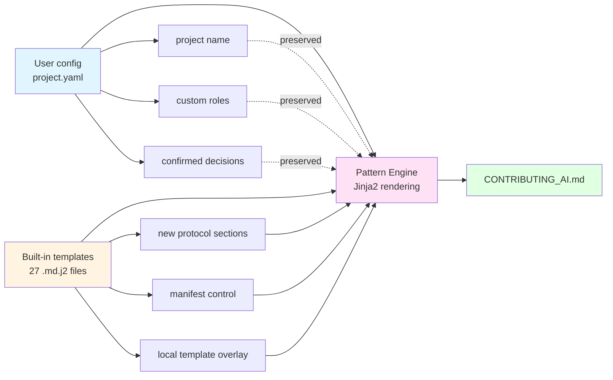

<div align="center">

# VibeCollab

**Configurable AI collaboration protocol framework with built-in knowledge capture and MCP Server**

[](https://badge.fury.io/py/vibe-collab)
[](https://github.com/flashpoint493/VibeCollab/actions/workflows/ci.yml)
[](https://www.python.org/downloads/)
[](https://opensource.org/licenses/MIT)
[](https://github.com/flashpoint493/VibeCollab/actions)
[](https://pypi.org/project/vibe-collab/)

**[English](README.md)** | [中文文档](README.zh-CN.md)

</div>

---

- **What it is**: A configurable AI collaboration protocol framework with built-in knowledge capture (Insight) and MCP Server.
- **Pain it solves**: Turns chaotic AI-assisted development into structured, auditable, and reusable collaboration workflows.
- **Get started**: Copy the text below and send it to your AI assistant (Cursor / CodeBuddy / Cline / ...):

> Read https://raw.githubusercontent.com/flashpoint493/VibeCollab/master/skill.md and follow the instructions.

That's all you need — the AI will install VibeCollab, initialize your project, and connect to your IDE automatically.

---

## Manual Setup

```bash
pip install vibe-collab
vibecollab init -n "MyProject" -d generic -o ./my-project
cd my-project
vibecollab hooks install              # Install pre-commit consistency checks
vibecollab mcp inject --ide cursor   # or: cline / codebuddy / all
```

That's it. Your AI assistant now follows structured collaboration protocols, captures reusable Insights, and maintains project context automatically. The pre-commit hook ensures every commit passes consistency checks.

---

## Who This Is For / Not For

**For**
- Teams using AI assistants (Cursor, Cline, CodeBuddy, OpenClaw, etc.) for daily development
- Projects that need auditable decision trails and knowledge accumulation across sessions
- Multi-role / multi-Agent environments requiring context isolation and conflict detection
- Anyone tired of repeating the same context setup at the start of every AI conversation

**Not For**
- One-off scripts or throwaway prototypes where process overhead isn't worth it
- Projects that don't use AI-assisted development at all
- Environments that cannot tolerate any workflow conventions (fully free-form only)

---

## What It Does

VibeCollab generates a `CONTRIBUTING_AI.md` collaboration protocol from a single `project.yaml` config, then connects to your AI IDE via MCP Server. During development, it provides:

- **Onboarding**: AI reads project context, progress, and past decisions automatically
- **Insight System**: Captures reusable knowledge from development sessions (tag search + semantic search)
- **Task Management**: Dialogue-driven task lifecycle (validate → solidify → rollback)
- **Protocol Checking**: Auto-verifies that AI follows collaboration rules
- **Multi-Role**: Isolated contexts per role/agent (DEV, QA, ARCH, PM, etc.) with cross-role conflict detection

> This project uses its own generated collaboration rules for development (meta-implementation), and integrates with the [llmstxt.org](https://llmstxt.org) standard.

### Before / After

| | Without VibeCollab | With VibeCollab |
|---|---|---|
| **Context** | Re-explain project background every conversation | `onboard` auto-restores full context |
| **Knowledge** | Hard-won experience lost between sessions | Insights captured, searchable, reusable |
| **Decisions** | Scattered in chat history, forgotten | Tiered records (S/A/B/C) with audit trail |
| **Multi-Agent** | Agents conflict, overwrite each other's work | Role-isolated contexts + conflict detection |
| **Automation** | Manual copy-paste loops | `plan run` — YAML-driven autonomous workflows |

---

## Features

### MCP Server + AI IDE Integration (v0.9.1)
- **MCP Server** (`vibecollab mcp serve`): Standard Model Context Protocol, auto-connects to Cursor/Cline/CodeBuddy/OpenClaw and any MCP-compatible agent
- **One-command config injection** (`vibecollab mcp inject`): Zero manual setup
- **19 Tools**: `insight_search`, `insight_add`, `insight_suggest`, `insight_graph`, `insight_export`, `check`, `onboard`, `next_step`, `search_docs`, `task_list`, `task_create`, `task_transition`, `session_save`, `guard_check`, `guard_list_rules`, `role_context`, `roadmap_status`, `roadmap_sync`, `project_prompt`
- **Resources**: Auto-exposes `CONTRIBUTING_AI.md`, `CONTEXT.md`, `DECISIONS.md`
- **Prompts**: Auto-injects project context and protocol rules at conversation start

### Insight Knowledge Capture
- **Signal-driven suggestions** (v0.9.2): Recommends candidate Insights from git diffs / doc changes / task transitions
- **Semantic search** (v0.9.0): Vector-indexed docs + Insights, pure-Python zero-dependency fallback
- **Tag + weight lifecycle**: Decay/reward mechanism, derived tracing, cross-role sharing

### Collaboration Engine
- **Pattern Engine**: 27+ Jinja2 templates → `CONTRIBUTING_AI.md`, manifest-controlled
- **Template Overlay**: Override any section via `.vibecollab/patterns/`
- **Decision Tiers**: S/A/B/C levels with review requirements
- **Audit Log**: Append-only JSONL with SHA-256 integrity

### Multi-Role (v0.11.0)
- Context isolation per role/agent (DEV, QA, ARCH, PM, TEST, DESIGN)
- Cross-role conflict detection (file, task, dependency)
- Role-based permissions (file_patterns, can_create_task_for, can_transition_to, can_approve_decision)
- Dynamic skill registration from Insights based on current role
- Shared Insight statistics and provenance tracing

### Execution Plan (v0.10.7)
- **Unified execution engine**: `vibecollab plan run` is the sole entry point for ALL automation workflows
- **3 host adapters**: `file_exchange` (file polling), `subprocess` (CLI tools), `auto` (keyboard simulation)
- **Auto adapter**: `--host auto:cursor` drives IDE via keyboard simulation — hands-free automation
- **File exchange protocol**: vibecollab sends instructions, IDE AI executes with tool-use, writes response back
- **YAML-driven workflows**: Define plans with `cli`, `assert`, `wait`, `prompt`, and `loop` actions
- **Goal-based termination**: Loop continues until `check_command` passes or `max_rounds` reached
- **Verbose logging**: `--verbose/-v` for timestamped per-step/per-round execution logs

### Git Hooks + Guard Protection (v0.11.0)
- **Pre-commit hooks** (`vibecollab hooks install`): Auto-run `vibecollab check` before every commit
- **Guard Protection Engine**: File operation interception with configurable rules (block/warn/allow)
- **`vibecollab check --guards`**: Scan all git-tracked files against guard rules
- **MCP Guard Tools**: `guard_check` for pre-flight file ops, `guard_list_rules` for rule discovery
- **Role permission enforcement**: Task create/transition checks against role permissions
- **Quality gate**: Blocks commits with insight fingerprint mismatches or protocol errors
- **Configurable rules**: project.yaml controls guards, hooks, and their severity

### YAML-first Document System (v0.12.0) ⭐ New
- **Core principle**: YAML is source of truth → Markdown is generated view
- **`vibecollab docs` command group**:
  - `docs list`: List all renderable YAML documents in docs/
  - `docs render --all`: Render all YAML docs to Markdown views
  - `docs render -k context -k roadmap`: Filter by document kind
  - `docs validate`: Validate YAML document structure
- **6 document types**: context, decisions, changelog, roadmap, prd, qa
- **24 Jinja2 templates**: Automatic YAML → Markdown rendering
- **Forward-compatible**: `kind + version` envelope pattern for schema evolution

### Workflow Automation (v0.12.0) ⭐ New
- **`vibecollab plan` workflow commands**:
  - `plan list`: List 3 pre-built workflows (daily-sync, release-prep, insight-collect)
  - `plan run <workflow>`: Execute workflow with --dry-run and --verbose support
  - `plan validate`: Validate workflow syntax before execution
- **Pre-built workflows**:
  - **daily-sync**: Check → validate → render docs → commit → push
  - **release-prep**: Test → build → package → tag (full release pipeline)
  - **insight-collect**: Index → suggest → export insights → auto-commit
- **Host adapters**: file_exchange, subprocess, auto:cursor for different execution modes

### Insight Derivation Chain (v0.12.0) ⭐ New
- **`insight graph --show-derivation`**: Visualize insight derivation tree (root → descendants)
- **`insight derive`**: Auto-detect derivation relationships when creating insights
  - Based on task activity and insight usage history
  - Configurable confidence threshold (`--min-confidence 0.8`)
- **Derivation detection**: Automatic parent insight suggestion with `--dry-run` preview
- **Traceability**: `insight trace` shows complete derivation chain and provenance
- **Mermaid export**: Generate diagrams for documentation

---

## Architecture Overview

> **Design principle**: One YAML config → structured protocol → MCP Server → AI IDE integration. Zero vendor lock-in, fully offline, your data stays local.

VibeCollab is built on **5 core pillars**:

| # | Pillar | Key Commands | Purpose |
|---|--------|-------------|---------|
| 1 | **Strict Consistency Checking** | `vibecollab check`, `health` | Protocol compliance, doc freshness, Insight integrity, Guard protection |
| 2 | **Multi-Role + Milestone Scheduling** | `task`, `roadmap`, `role` | Role-isolated contexts (DEV/QA/ARCH/PM), ROADMAP<->Task sync, permissions |
| 3 | **Complete Document-Aligned Context** | `onboard`, `session_save` | CONTEXT/DECISIONS/CHANGELOG/PRD — auto-restored every conversation |
| 4 | **Insight Knowledge System** | `insight add/search/suggest` | Capture, index, retrieve reusable knowledge across sessions |
| 5 | **Autonomous Loop / Self-Iteration** | `plan run`, `auto` | Unified execution engine with 3 host adapters |

### Workflow

```
1. Setup              pip install vibe-collab && vibecollab init
                             ↓
2. Connect IDE        vibecollab mcp inject --ide cursor
                             ↓
3. Conversation       onboard → read CONTEXT/DECISIONS/ROADMAP → Insight search
        ↓
4. Dev Loop           TaskManager (create → transition → solidify)
        ↓                    ↓
5. Knowledge          Insight add/suggest → reusable knowledge captured
        ↓
6. Session End        Update CONTEXT + CHANGELOG → check → session_save → git commit
        ↓
7. Automation         plan run --host file_exchange  (IDE file polling)
   (optional)         plan run --host auto:cursor    (keyboard simulation)
                      plan run --host subprocess     (CLI tools like aider)
```

### Role System

Roles are defined in `project.yaml` and scaffolded via CLI:

```bash
vibecollab init -n "MyProject" -d generic -o ./my-project --multi-dev  # Create with roles
vibecollab role init -d dev          # Initialize a specific role context
vibecollab role switch qa            # Switch to QA role
vibecollab role list                 # List all roles
vibecollab role permissions          # View current role's permissions
```

Each role gets isolated `docs/roles/{role}/CONTEXT.md` + `.metadata.yaml`. Cross-role conflicts are auto-detected, and permissions are enforced on task operations.

---

## Install

```bash
# Basic
pip install vibe-collab

# With MCP Server support (recommended for AI IDE integration)
pip install vibe-collab

# With semantic search (sentence-transformers backend)
pip install vibe-collab[embedding]

# All optional dependencies
pip install vibe-collab[embedding,llm]
```

Or from source:

```bash
git clone https://github.com/flashpoint493/VibeCollab.git
cd VibeCollab
pip install -e "."
```

---

## Quick Start

### Initialize a New Project

```bash
# Generic project
vibecollab init -n "MyProject" -d generic -o ./my-project

# Multi-role mode
vibecollab init -n "MyProject" -d generic -o ./my-project --multi-dev

# Game project (with GM command injection)
vibecollab init -n "MyGame" -d game -o ./my-game

# Web project (with API doc injection)
vibecollab init -n "MyWebApp" -d web -o ./my-webapp
```

### Generated Project Structure

```
my-project/
├── CONTRIBUTING_AI.md         # AI collaboration rules
├── llms.txt                   # Project context (llmstxt.org standard)
├── project.yaml               # Project config (single source of truth)
└── docs/
    ├── CONTEXT.md             # Current context (updated every session)
    ├── DECISIONS.md           # Decision records
    ├── CHANGELOG.md           # Changelog
    ├── ROADMAP.md             # Roadmap + iteration backlog
    └── QA_TEST_CASES.md       # Product QA test cases
```

### Customize and Regenerate

```bash
# Edit project.yaml then regenerate
vibecollab generate -c project.yaml

# Validate config
vibecollab validate -c project.yaml
```

---

## AI IDE Integration

> **Recommended**: MCP Server + IDE Rule/Instructions for seamless per-conversation integration

### Cursor

```bash
pip install vibe-collab
vibecollab mcp inject --ide cursor
```

Generates `.cursor/mcp.json`. Restart Cursor and add to Settings > Rules:

```
At conversation start, call the vibecollab MCP onboard tool for project context.
Before ending, call check to verify protocol compliance, update CONTEXT.md and CHANGELOG.md,
capture valuable Insights (insight_add), then git commit.
```

### VSCode + Cline

```bash
pip install vibe-collab
vibecollab mcp inject --ide cline
```

### CodeBuddy

```bash
pip install vibe-collab
vibecollab mcp inject --ide codebuddy
```

CodeBuddy reads the project-level `.mcp.json` config automatically -- `vibecollab mcp inject` creates it for you.

### OpenClaw

VibeCollab works as a standard MCP Server — any MCP-compatible agent can connect directly:

```bash
openclaw mcp add --transport stdio vibecollab vibecollab mcp serve
```

OpenClaw will then have access to all VibeCollab tools (onboard, Insight, Task, check, etc.) out of the box.

### Comparison

| Approach | Token Efficiency | Protocol Compliance | Setup | Team Sharing |
|----------|:---:|:---:|:---:|:---:|
| MCP + IDE Rule | High | High | One-time | Via git |
| MCP + Custom Instructions | High | High | One-time | Manual sync |
| `vibecollab prompt` paste | Medium | Medium | Every time | N/A |
| Manual doc reading | Low | Low | None | N/A |

---

## CLI Reference

```bash
vibecollab --help                              # Help
vibecollab --version                           # Show version
vibecollab init -n <name> -d <domain> -o <dir> # Init project
vibecollab generate -c <config>                # Generate collaboration rules
vibecollab validate -c <config>                # Validate config
vibecollab upgrade                             # Upgrade protocol to latest

# MCP Server
vibecollab mcp serve                           # Start MCP Server (stdio)
vibecollab mcp inject --ide all                # Inject config to all IDEs

# Agent Guidance
vibecollab onboard [-d <role>]                  # AI onboarding
vibecollab next                                # Smart action suggestions
vibecollab prompt [--compact] [--copy]         # Generate LLM context prompt

# Semantic Search
vibecollab index [--rebuild]                   # Index docs and Insights
vibecollab search <query>                      # Semantic search

# Insight Knowledge Capture
vibecollab insight add --title --tags --category
vibecollab insight derive --title ... --source-task TASK-XXX   # Auto derivation (v0.12.0)
vibecollab insight graph --show-derivation     # Derivation tree (v0.12.0)
vibecollab insight search --tags/--semantic
vibecollab insight suggest                     # Signal-driven recommendations
vibecollab insight list/show/use/decay/check/delete/bookmark/trace/who/stats

# Task Management
vibecollab task create/list/show/suggest/transition/solidify/rollback

# Roadmap Integration
vibecollab roadmap status/sync/parse

# Multi-Role (v0.11.0)
vibecollab role whoami/list/status/switch/permissions/init/sync/conflicts

# Git Hooks (v0.11.0)
vibecollab hooks install [-t TYPE] [--force]   # Install Git hooks
vibecollab hooks uninstall [-t TYPE] [--all]   # Remove hooks
vibecollab hooks run <hook_type>               # Manual hook execution
vibecollab hooks status [--json]               # Hook status overview
vibecollab hooks list                          # List installed hooks

# YAML-first Documents (v0.12.0)
vibecollab docs list                           # List renderable YAML docs
vibecollab docs render --all                   # Render all docs
vibecollab docs render -k context -k roadmap   # Filter by kind
vibecollab docs validate <file.yaml>           # Validate document

# Execution Plan & Workflows (v0.12.0)
vibecollab plan list                           # List pre-built workflows
vibecollab plan run daily-sync                 # Run workflow
vibecollab plan run release-prep --dry-run     # Dry-run mode
vibecollab plan run insight-collect -v         # Verbose output
vibecollab plan validate <workflow>            # Validate workflow

# Legacy Plan (v0.10.7)
vibecollab plan run <plan.yaml> [-v] [--dry-run] [--json]
vibecollab plan run <plan.yaml> --host auto:cursor  # Auto adapter

# Auto Driver Shortcuts (v0.10.7 — delegates to plan run)
vibecollab auto list                           # List preset automation plans
vibecollab auto init <plan.yaml> [--ide cursor] # Create .bat launcher
vibecollab auto status                         # Check running status
vibecollab auto stop                           # Stop running process

# Config Management
vibecollab config setup                        # Interactive LLM config wizard
vibecollab config show                         # Show current config
vibecollab config set <key> <value>            # Set config value
vibecollab config path                         # Show config file path

# Health & Checking
vibecollab check [--no-insights] [--strict] [--guards/--no-guards]  # Protocol compliance
vibecollab health [--json]                     # Health score (0-100)
```

---

## Protocol Upgrade

```bash
pip install --upgrade vibe-collab
cd your-project
vibecollab upgrade          # Upgrade protocol
vibecollab upgrade --dry-run  # Preview changes
```

**How it works**: Your `project.yaml` config is preserved (project name, custom roles, confirmed decisions, domain extensions). The built-in Jinja2 templates are updated to the latest version and re-rendered.



---

## Core Concepts

### Vibe Development Philosophy

> **The conversation itself is the most valuable artifact -- don't rush to produce results, plan together step by step.**

- AI is a **collaboration partner**, not just an executor
- **Align understanding** before writing code
- Every decision is a result of **shared thinking**
- The dialogue itself is part of the **design process**

### Task Units

> **Development progresses by dialogue-driven task units, not calendar dates.**

```
Task Unit:
├── ID: TASK-{role}-{seq}       # e.g. TASK-DEV-001
├── role: DESIGN/ARCH/DEV/PM/QA/TEST
├── feature: {related module}
├── status: TODO → IN_PROGRESS → REVIEW → DONE
└── dialogue_rounds: {rounds to complete}
```

### Decision Tiers

| Tier | Type | Scope | Review |
|-----|------|-------|--------|
| **S** | Strategic | Overall direction | Must have human approval |
| **A** | Architecture | System design | Human review |
| **B** | Implementation | Specific approach | Quick confirm |
| **C** | Detail | Naming, params | AI decides autonomously |

---

## FAQ

**How is this different from Cursor Rules / .cursorrules?**
Cursor Rules are IDE-specific and static. VibeCollab generates rules from a structured `project.yaml` config, supports multiple IDEs via MCP, includes knowledge capture (Insights), task management, and multi-role coordination. Rules evolve with your project via `vibecollab upgrade`.

**Does this modify my code?**
No. VibeCollab generates collaboration protocol documents and provides tools for AI assistants. It does not modify your application source code.

**Do I need an LLM API key?**
No. All features (init, generate, check, MCP Server, Insights, Tasks, Execution Plan, Auto Driver) work entirely offline. No LLM API key is required.

**Can I use it with an existing project?**
Yes. Run `vibecollab init` in your project root. It creates `project.yaml` and `docs/` alongside your existing files without touching them.

---

## Anti-Examples (What This Is NOT For)

- Using it as a generic task runner or build system
- One-off scripts or throwaway prototypes where process overhead isn't justified
- Projects that don't involve AI-assisted development
- Expecting it to auto-fix code -- it guides collaboration, not execution
- Skipping `project.yaml` config and manually editing `CONTRIBUTING_AI.md` (it will be overwritten on next generate)

---

## Version History

| Version | Date | Highlights |
|---------|------|-----------|
| v0.12.0 | 2026-04-02 | YAML-first docs: `docs` command group + 3 pre-built workflows (`plan run`) + Insight derivation chain + 1731 tests |
| v0.11.0 | 2026-04-01 | Role-driven architecture: permissions + guard engine + MCP guard tools + `check --guards` + hooks CLI + dynamic skill registration |
| v0.10.14 | 2026-03-30 | Release engineering: Git hooks framework, commit-type dynamic check, strict doc-code sync, guard engine core |
| v0.10.9 | 2026-03-11 | Get-started rewrite: "copy one line to your AI" with raw skill.md link; PyPI README synced |
| v0.10.8 | 2026-03-11 | README facade: centered header, rich badges (CI/Tests/Platform), Before/After table, OpenClaw integration, i18n sync |
| v0.10.7 | 2026-03-11 | CI/CD fixes: cross-platform test fixes (4 tests), bash shell for Windows, Python 3.9 dropped |
| v0.10.6 | 2026-03-09 | CLI cleanup: removed redundant commands (pipeline group, export-template, version-info, ai group); unified version |
| v0.10.5 | 2026-03-09 | Auto Driver: autonomous IDE keyboard simulation + preset plans + .bat launcher |
| v0.10.4 | 2026-03-09 | Execution Plan: YAML-driven workflow + autonomous loop engine + host adapters (101 tests) |
| v0.9.7 | 2026-03-03 | Source code i18n (96 files English) + module restructure (7 subpackages) |
| v0.9.6 | 2026-02-28 | CLI i18n framework (gettext) + zh_CN translation + 316 translatable strings |
| v0.9.5 | 2026-02-28 | ROADMAP <-> Task integration + bilingual README + MCP roadmap tools |
| v0.9.4 | 2026-02-27 | Insight quality lifecycle (dedup, graph, export/import) |
| v0.9.3 | 2026-02-27 | Task/EventLog core workflow + task transition/solidify/rollback + MCP 12 Tools |
| v0.9.2 | 2026-02-27 | Signal-driven Insight suggestions + Session persistence + MCP enhancements |
| v0.9.1 | 2026-02-27 | MCP Server + AI IDE integration (Cursor/Cline/CodeBuddy) + PyPI publish |
| v0.9.0 | 2026-02-27 | Semantic search engine (Embedder + VectorStore + incremental indexing) |
| v0.8.0 | 2026-02-27 | Config management + 1074 tests + Windows GBK compat + Insight workflow |
| v0.7.1 | 2026-02-25 | Task-Insight auto-linking + Task CLI |
| v0.7.0 | 2026-02-25 | Insight knowledge system + Agent guidance (onboard/next) |
| v0.6.0 | 2026-02-24 | Test coverage 58%->68%, conflict detection + PRD management |
| v0.5.0 | 2026-02-10 | Multi-role / multi-Agent support |

Full changelog: [docs/CHANGELOG.md](docs/CHANGELOG.md)

---

## Development

```bash
pip install -e ".[dev,llm]"
pytest
ruff check src/vibecollab/ tests/
vibecollab generate -c project.yaml
vibecollab check
vibecollab health
```

---

## License

MIT

---

*Born from game development practice -- using collaboration protocols to build a collaboration protocol generator. Current version v0.12.3.*
