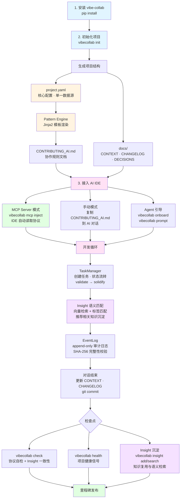
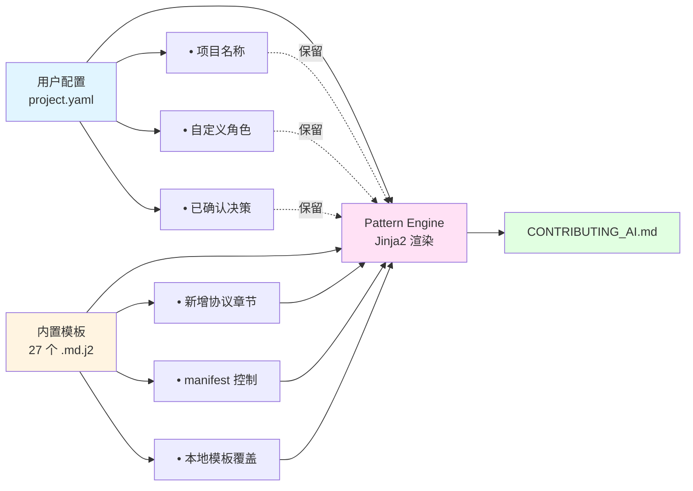

# VibeCollab

[](https://badge.fury.io/py/vibe-collab)
[](https://www.python.org/downloads/)
[](https://opensource.org/licenses/MIT)

[English](README.md) | **中文文档**

---

- **它是什么**: 一个可配置的 AI 协作协议框架，内置知识沉淀系统 (Insight) + MCP Server
- **解决什么痛点**: 将混乱的 AI 辅助开发变成结构化、可审计、可复用的协作工作流
- **60 秒上手**: `pip install vibe-collab && vibecollab init -n MyProject -d generic -o ./my-project`

---

## 立刻体验

```bash
pip install vibe-collab
vibecollab init -n "MyProject" -d generic -o ./my-project
cd my-project

# 接入 AI IDE（Cursor / Cline / CodeBuddy）
pip install vibe-collab
vibecollab mcp inject --ide cursor   # 或: cline / codebuddy / all
```

完成。你的 AI 助手现在会自动遵循结构化协作协议、沉淀可复用的 Insight、维护项目上下文。

---

## 适用 / 不适用场景

**适合**
- 使用 AI 助手（Cursor、Cline、CodeBuddy 等）进行日常开发的团队
- 需要跨对话保留决策记录和知识积累的项目
- 多角色 / 多 Agent 协同环境，需要上下文隔离和冲突检测
- 厌倦了每次 AI 对话都要重新输入项目背景的人

**不适合**
- 一次性脚本或临时原型，流程开销不划算
- 完全不使用 AI 辅助开发的项目
- 无法接受任何工作流约束（只能纯自由发挥）的环境

---

**从 YAML 配置生成标准化的 AI 协作协议，内置知识沉淀系统 + MCP Server，支持多角色/多 Agent 协同开发**

将 Vibe Development 哲学和 LLM 协作协议抽象为可配置、可复用的框架。核心特性包括：**MCP Server 无缝集成 AI IDE**、Insight 知识沉淀与语义检索、Agent 引导系统 (onboard/next)、多角色独立上下文管理、跨角色冲突检测、文档一致性检查等。

> 本项目自身也使用生成的协作规则进行开发（元实现），并支持与 [llmstxt.org](https://llmstxt.org) 标准无缝集成

---

## 工作流程图



---

## 特性

### MCP Server + AI IDE 无缝集成 (v0.9.1 NEW)
- **MCP Server** (`vibecollab mcp serve`): 标准 Model Context Protocol 实现，Cursor/Cline/CodeBuddy 自动接入
- **一键配置注入** (`vibecollab mcp inject`): 自动生成 IDE 配置文件，零手动操作
- **Tools**: `insight_search`, `insight_add`, `insight_suggest`, `check`, `onboard`, `next_step`, `search_docs`, `task_list`, `task_create`, `task_transition`, `session_save` 等 12 个工具
- **Resources**: 自动暴露 `CONTRIBUTING_AI.md`, `CONTEXT.md`, `DECISIONS.md` 等协议文档
- **Prompts**: 对话开始时自动注入项目上下文和协议规则

### Insight 信号驱动沉淀 (v0.9.2 NEW)
- **`insight suggest`**: 从 git 增量/文档变更/Task 变化中推荐候选 Insight，替代纯 LLM 推理
- **信号快照** (`.vibecollab/insight_signal.json`): 记录上次沉淀时间点，`insight add` 自动更新
- **Session 持久化** (`.vibecollab/sessions/`): 对话 summary 存储，MCP `session_save` 自动触发

### 语义检索引擎 (v0.9.0)
- **向量化索引** (`vibecollab index`): 项目文档 + Insight 增量索引，纯 Python 零依赖降级方案
- **语义搜索** (`vibecollab search`): 跨文档/Insight 统一语义搜索
- **onboard 增强**: 自动向量检索与当前任务相关的 Insight

### 知识沉淀与复用
- **Insight 沉淀系统** (v0.7.0): 从开发实践中提取可复用知识单元，Tag 驱动搜索 + 语义搜索，衰减/奖励生命周期，派生溯源
- **Task-Insight 自动关联** (v0.7.1): 创建任务时自动搜索关联 Insight，关键词提取 + Jaccard 匹配
- **Agent 引导系统** (v0.7.0): `vibecollab onboard` 接入引导 + `vibecollab next` 智能行动建议 + `vibecollab prompt` 上下文生成

### 协作引擎
- **Pattern Engine**: Jinja2 模板驱动的 CONTRIBUTING_AI.md 生成，27+ 个 `.md.j2` 模板 + manifest 控制
- **Template Overlay**: `.vibecollab/patterns/` 本地模板覆盖，支持章节增删改
- **三模式 AI CLI**: `vibecollab ai ask/chat` 人机交互 + `vibecollab ai agent` 自主模式 (Plan→Execute→Solidify)
- **LLM 客户端**: Provider-agnostic (OpenAI-compatible + Anthropic Claude)

### 项目管理
- **任务生命周期**: validate→solidify→rollback 状态管理 + 自动 Insight 关联
- **审计日志**: Append-only JSONL EventLog，SHA-256 完整性校验
- **协议自检**: `vibecollab check` 检查协议遵循 + `--insights` Insight 一致性校验
- **项目健康信号**: `vibecollab health` 评分 (0-100 + A/B/C/D/F)，10+ 信号类型
- **文档一致性检查**: linked_groups 三级检查 (local_mtime / git_commit / release)

### 多角色协同
- **多角色支持**: 多角色/多 Agent 协同开发（DEV/QA/ARCH/PM/TEST/DESIGN），独立上下文管理
- **冲突检测**: 自动检测跨角色的文件冲突、任务冲突、依赖冲突
- **跨开发者 Insight 共享**: 收藏/使用/贡献统计 + 溯源可视化

### 基础设施
- **CI/CD 自动发布**: GitHub Release 触发自动 PyPI 发布
- **领域扩展**: 支持 game/web/data 等领域的定制扩展
- **自举实现**: 本项目使用自身生成的协作协议进行开发

---

## 安装

```bash
# 基础安装
pip install vibe-collab

# 含 MCP Server 支持 (推荐，用于 AI IDE 集成)
pip install vibe-collab

# 含语义搜索 (sentence-transformers 后端)
pip install vibe-collab[embedding]

# 全部可选依赖
pip install vibe-collab[embedding,llm]
```

或从源码安装：

```bash
git clone https://github.com/flashpoint493/VibeCollab.git
cd VibeCollab
pip install -e "."
```

---

## 快速开始

### 初始化新项目

```bash
# 通用项目
vibecollab init -n "MyProject" -d generic -o ./my-project

# 多角色模式项目
vibecollab init -n "MyProject" -d generic -o ./my-project --multi-dev

# 游戏项目（含 GM 命令注入）
vibecollab init -n "MyGame" -d game -o ./my-game

# Web 项目（含 API 文档注入）
vibecollab init -n "MyWebApp" -d web -o ./my-webapp

# 数据项目（含数据处理流程）
vibecollab init -n "MyDataProject" -d data -o ./my-data-project
```

### 生成的项目结构

#### 单开发者模式（默认）

```
my-project/
├── CONTRIBUTING_AI.md         # AI 协作规则文档
├── llms.txt                   # 项目上下文文档（已集成协作规则引用）
├── project.yaml                # 项目配置 (可编辑)
└── docs/
    ├── CONTEXT.md              # 当前上下文 (每次对话更新)
    ├── DECISIONS.md            # 决策记录
    ├── CHANGELOG.md            # 变更日志
    ├── ROADMAP.md              # 路线图 + 迭代建议池
    └── QA_TEST_CASES.md        # 产品QA测试用例
```

#### 多角色模式（`--multi-dev`）

```
my-project/
├── CONTRIBUTING_AI.md
├── llms.txt
├── project.yaml
└── docs/
    ├── CONTEXT.md              # 全局聚合视图（自动生成，只读）
    ├── CHANGELOG.md            # 全局变更日志
    ├── DECISIONS.md            # 全局决策记录
    ├── ROADMAP.md
    ├── QA_TEST_CASES.md
    └── developers/             # 开发者工作空间
        ├── COLLABORATION.md    # 协作关系文档
        ├── dev/                # DEV 角色目录
        │   ├── CONTEXT.md      # DEV 的工作上下文
        │   └── .metadata.yaml  # 元数据（含角色规则）
        └── qa/                 # QA 角色目录
            ├── CONTEXT.md
            └── .metadata.yaml
```

> **💡 llms.txt 集成**：工具会自动检测项目中是否已有 `llms.txt` 文件。如果存在，会在其中添加 AI Collaboration 章节引用协作规则；如果不存在，会创建一个符合 [llmstxt.org](https://llmstxt.org) 标准的 `llms.txt` 文件。

### 文档体系说明

项目初始化后会生成一套完整的文档体系，每个文档都有明确的用途和更新时机：

#### 关键文件职责

| 文件 | 职责 | 更新时机 |
|-----|------|---------|
| `CONTRIBUTING_AI.md` | AI 协作规则，顶层指导 | 协作方式演进时 |
| `llms.txt` | 项目上下文摘要 (llmstxt.org 标准) | 项目信息变更时 |
| `docs/CONTEXT.md` | 当前开发上下文 | 每次对话结束时 |
| `docs/DECISIONS.md` | 重要决策记录 | 每次 S/A 级决策后 |
| `docs/CHANGELOG.md` | 版本变更日志 | 每次有效对话后 |
| `docs/QA_TEST_CASES.md` | 产品QA测试用例 | 每个功能完成时 |
| `docs/PRD.md` | 产品需求文档 | 需求变更时 |
| `docs/ROADMAP.md` | 路线图+迭代建议 | 里程碑规划/反馈时 |

**多角色模式额外文件**：

| 文件 | 职责 | 更新时机 |
|-----|------|---------|
| `docs/developers/COLLABORATION.md` | 团队协作关系和任务分配 | 任务分配/交接时 |
| `docs/developers/{role_code}/CONTEXT.md` | 角色工作上下文 | 每次对话结束时 |
| `docs/developers/{role_code}/.metadata.yaml` | 角色元数据（focus、triggers 等） | 角色配置变更时 |

> **⚠️ 上下文保存协议**: 每次对话结束时，AI 应：
> 1. 更新 `docs/CONTEXT.md` 保存当前状态
> 2. 更新 `docs/CHANGELOG.md` 记录本次产出
> 3. 如有新决策，更新 `docs/DECISIONS.md`
> 4. **必须执行 git commit** 记录本次对话产出

#### 📄 `CONTRIBUTING_AI.md` - AI 协作规则文档
- **用途**: 项目的顶层协作规则，定义 AI 与开发者的协作方式
- **内容**: 包含核心理念、角色定义、决策分级、流程协议等完整协议
- **更新时机**: 当协作方式演进时（通过 `vibecollab generate` 重新生成）
- **特点**: 由 `project.yaml` 配置自动生成，是 AI 理解项目规则的主要依据
- **与 llms.txt 的关系**: 在 `llms.txt` 中通过引用链接指向此文档

#### 📄 `llms.txt` - 项目上下文文档（可选）
- **用途**: 符合 [llmstxt.org](https://llmstxt.org) 标准的项目上下文文档
- **内容**: 项目概述、快速开始、文档索引等
- **生成方式**: 
  - 如果项目已存在 `llms.txt`，工具会自动在其中添加 AI Collaboration 章节引用
  - 如果不存在，工具会创建一个新的 `llms.txt` 文件
- **特点**: 与 `CONTRIBUTING_AI.md` 互补，前者描述"项目是什么"，后者定义"如何协作"

#### 📝 `docs/CONTEXT.md` - 当前开发上下文
- **用途**: 记录当前开发进度、正在进行的工作、待解决的问题
- **内容**: 
  - 当前任务状态
  - 最近完成的工作
  - 下一步计划
  - 技术债务和已知问题
- **更新时机**: **每次对话结束时必须更新**
- **重要性**: ⭐ AI 在对话开始时必须读取此文件以恢复上下文

#### 📋 `docs/DECISIONS.md` - 重要决策记录
- **用途**: 记录所有 S/A 级重要决策，形成项目决策历史
- **内容格式**:
  ```markdown
  ## DECISION-001: 技术框架选择
  - **等级**: A
  - **角色**: [ARCH]
  - **问题**: 选择前端框架
  - **决策**: React + TypeScript
  - **理由**: 团队熟悉，生态完善
  - **日期**: 2026-01-20
  - **状态**: CONFIRMED
  ```
- **更新时机**: 每次 S/A 级决策确认后
- **价值**: 为后续决策提供参考，避免重复讨论

#### 📊 `docs/CHANGELOG.md` - 版本变更日志
- **用途**: 记录每次对话的产出和变更
- **内容**: 
  - 新增功能
  - Bug 修复
  - 配置变更
  - 文档更新
- **更新时机**: **每次有效对话后**
- **格式**: 遵循 [Keep a Changelog](https://keepachangelog.com/) 规范

#### 🗺️ `docs/ROADMAP.md` - 路线图与迭代建议池
- **用途**: 规划项目里程碑和收集迭代建议
- **内容结构**:
  - **路线图**: 当前里程碑计划
  - **迭代建议池**: QA/用户反馈的功能建议
    - ✅ 纳入当前里程碑
    - ⏳ 延后到下个里程碑
    - ❌ 拒绝（不符合方向）
    - 🔄 合并其他迭代
- **更新时机**: 里程碑规划时、收到反馈时
- **价值**: 帮助 PM 管理需求优先级

#### ✅ `docs/QA_TEST_CASES.md` - 产品QA测试用例
- **用途**: 从用户视角编写的功能验收测试用例
- **内容格式**:
  ```markdown
  ## TC-MODULE-001: 用户登录功能
  - **功能**: 用户登录
  - **前置条件**: 用户已注册
  - **测试步骤**:
    1. 打开登录页面
    2. 输入用户名和密码
    3. 点击登录按钮
  - **预期结果**: 登录成功，跳转到主页
  - **状态**: 🟢 PASS
  ```
- **更新时机**: 每个功能完成时
- **特点**: 与单元测试互补，关注功能完整性而非代码正确性

#### ⚙️ `project.yaml` - 项目配置文件
- **用途**: 项目的核心配置文件，定义所有协作规则
- **内容**: 
  - 项目基本信息
  - 角色定义
  - 决策分级
  - 任务单元配置
  - 对话流程协议
  - 测试体系配置
  - 里程碑定义
  - 领域扩展配置
- **更新时机**: 需要调整协作规则时
- **特点**: 修改后通过 `vibecollab generate` 重新生成 `CONTRIBUTING_AI.md`

### 自定义后重新生成

```bash
# 编辑 project.yaml 后重新生成（默认输出 CONTRIBUTING_AI.md 并集成 llms.txt）
vibecollab generate -c project.yaml

# 指定输出文件
vibecollab generate -c project.yaml -o CONTRIBUTING_AI.md

# 不集成 llms.txt
vibecollab generate -c project.yaml --no-llmstxt

# 验证配置
vibecollab validate -c project.yaml
```

---

## 生成的 CONTRIBUTING_AI.md 包含章节

> 由 Pattern Engine 通过 `manifest.yaml` 控制，27 个 Jinja2 模板按序渲染

| 章节 | 说明 |
|------|------|
| 核心理念 | Vibe Development 哲学、决策质量观 |
| 职能角色定义 | 可自定义的角色体系 (DESIGN/ARCH/DEV/PM/QA/TEST) |
| 决策分级制度 | S/A/B/C 四级决策及 Review 要求 |
| 开发流程协议 | 对话开始/结束时的强制流程 |
| 需求澄清协议 | 模糊需求 → 结构化描述转化 |
| 任务单元管理 | 对话任务单元定义、状态流转、依赖管理 |
| 迭代建议管理协议 | QA 建议 → PM 评审 → 纳入/延后/拒绝 |
| QA 验收协议 | 测试用例要素、快速验收模板 |
| Git 协作规范 | 分支策略、Commit 前缀 |
| 测试体系 | Unit Test + Product QA 双轨 |
| 里程碑定义 | 生命周期、Bug 优先级 |
| Prompt 工程最佳实践 | 有效提问模板、高价值引导词 |
| 多角色协作协议 | 身份识别、上下文管理、冲突检测 (条件渲染) |
| Insight 沉淀协议 | 知识沉淀/搜索/复用/衰减 + CLI 命令参考 |
| Task 管理 | 任务创建/状态流转/Insight 自动关联 |
| 符号学标注系统 | 统一的状态/优先级符号 |
| 协议自检 | 触发词、检查项、Insight 一致性 |
| PRD 管理 | 需求文档管理协议 |

> 支持 **Template Overlay**：在项目 `.vibecollab/patterns/` 中放置自定义模板可覆盖内置章节

---

## CLI 命令

```bash
vibecollab --help                              # 查看帮助
vibecollab --version                           # 查看版本
vibecollab init -n <name> -d <domain> -o <dir> # 初始化项目
vibecollab init ... --multi-dev                # 初始化多角色项目
vibecollab generate -c <config> -o <output>    # 生成协作规则文档（默认集成 llms.txt）
vibecollab validate -c <config>                # 验证配置
vibecollab upgrade                             # 升级协议到最新版本
vibecollab domains                             # 列出支持的领域
vibecollab templates                           # 列出可用模板

# MCP Server (v0.9.1+)
vibecollab mcp serve                           # 启动 MCP Server (stdio 模式)
vibecollab mcp serve --transport sse           # SSE 模式 (远程调试)
vibecollab mcp config --ide cursor             # 输出 IDE 配置内容
vibecollab mcp inject --ide all                # 自动注入配置到所有 IDE

# Agent 引导 (v0.7.0+)
vibecollab onboard [-d <developer>] [--json]   # AI 接入引导（项目概况/进度/决策/待办）
vibecollab next [--json]                       # 智能行动建议（文档同步/超时/缺失文件）
vibecollab prompt [--compact] [--copy] [-d]    # 生成 LLM 上下文 prompt 文本

# 语义检索 (v0.9.0+)
vibecollab index [--rebuild] [--backend]       # 索引项目文档和 Insight
vibecollab search <query> [--type] [--min-score]  # 语义搜索文档和 Insight

# Insight 沉淀 (v0.7.0+)
vibecollab insight list [--active-only] [--json]   # 列出所有沉淀
vibecollab insight show <id>                       # 查看沉淀详情
vibecollab insight add --title --tags --category   # 创建沉淀
vibecollab insight search --tags/--semantic        # 搜索沉淀 (标签/语义)
vibecollab insight suggest [--json] [--auto-confirm]  # 信号驱动候选推荐 (v0.9.2+)
vibecollab insight use <id>                        # 记录使用，奖励权重
vibecollab insight decay [--dry-run]               # 执行权重衰减
vibecollab insight check [--json]                  # 一致性校验
vibecollab insight delete <id> [-y]                # 删除沉淀
vibecollab insight bookmark/unbookmark <id>        # 收藏/取消收藏
vibecollab insight trace <id> [--json]             # 溯源树可视化
vibecollab insight who <id> [--json]               # 跨开发者使用信息
vibecollab insight stats [--json]                  # 跨开发者共享统计

# Task 管理 (v0.7.1+)
vibecollab task create --id --role --feature       # 创建任务（自动关联 Insight）
vibecollab task list [--status] [--assignee]       # 列出任务
vibecollab task show <id>                          # 任务详情
vibecollab task suggest <id> [-n limit]            # 推荐关联 Insight
vibecollab task transition <id> <status>           # 推进任务状态 (v0.9.3+)
vibecollab task solidify <id>                      # 固化任务 → DONE (v0.9.3+)
vibecollab task rollback <id> [-r reason]          # 回滚任务状态 (v0.9.3+)

# 多角色命令 (v0.5.0+)
vibecollab dev whoami                          # 查看当前开发者身份
vibecollab dev list                            # 列出所有开发者
vibecollab dev status <developer>              # 查看开发者状态
vibecollab dev sync [--aggregate]              # 同步/聚合上下文
vibecollab dev init --developer <name>         # 初始化新开发者
vibecollab dev switch <developer>              # 切换到指定开发者
vibecollab dev conflicts [-v]                  # 检测跨开发者冲突

# 协议自检与健康
vibecollab check [--verbose] [--strict]        # 协议遵循检查
vibecollab check --insights                    # 含 Insight 一致性校验
vibecollab health [--json]                     # 项目健康评分 (0-100)

# Config 配置管理 (v0.8.0+)
vibecollab config setup                        # 交互式 LLM 配置向导
vibecollab config show                         # 查看当前配置
vibecollab config set <key> <value>            # 设置配置项
vibecollab config path                         # 显示配置文件路径

# AI 人机交互 (experimental, v0.5.8+)
vibecollab ai ask "问题"                       # 单轮 AI 提问
vibecollab ai chat                             # 多轮对话模式
vibecollab ai agent plan/run/serve             # Agent 自主模式 (冻结)
```

---

## 协议版本升级

当 vibecollab 包有新版本时，已有项目可以无缝升级：

```bash
# 升级当前项目的协议
pip install --upgrade vibe-collab
cd your-project
vibecollab upgrade

# 预览变更（不实际修改）
vibecollab upgrade --dry-run

# 指定配置文件
vibecollab upgrade -c project.yaml
```

**升级原理**：



**保留的用户配置**：
- `project.name`, `project.version`, `project.domain`
- `roles` - 自定义角色体系
- `confirmed_decisions` - 已确认的决策记录
- `domain_extensions` - 领域扩展配置

---

## 核心概念

### Vibe Development 哲学

> **最珍贵的是对话过程本身，不追求直接出结果，而是步步为营共同规划。**

- AI 不是执行者，而是**协作伙伴**
- 不急于产出代码，先**对齐理解**
- 每个决策都是**共同思考**的结果
- 对话本身就是**设计过程**的一部分

### 任务单元 (Task Unit) ⭐

> **开发不按日期，按对话任务单元推进**

任务单元是项目管理的核心概念，每个任务单元代表一次完整的对话协作周期：

```
任务单元 (Task Unit):
├── ID: TASK-{role}-{seq}      # 如 TASK-DEV-001
├── role: DESIGN/ARCH/DEV/PM/QA/TEST
├── feature: {关联的功能模块}
├── dependencies: {依赖的任务ID}
├── output: {预期输出}
├── status: TODO / IN_PROGRESS / REVIEW / DONE
└── dialogue_rounds: {完成所需的对话轮数}
```

**任务单元的优势**：
- ✅ **对话驱动**：以对话为单位推进，而非时间线
- ✅ **状态清晰**：每个任务都有明确的状态流转
- ✅ **依赖管理**：支持任务间的依赖关系
- ✅ **可追溯**：每个任务单元都有完整的对话历史

**使用场景**：
- 开始新功能开发时，创建 `TASK-DEV-001`
- 需要架构决策时，创建 `TASK-ARCH-001`
- QA 验收时，创建 `TASK-QA-001`

### 决策分级制度

| 等级 | 类型 | 影响范围 | Review 要求 |
|-----|------|---------|------------|
| **S** | 战略决策 | 整体方向 | 必须人工确认 |
| **A** | 架构决策 | 系统设计 | 人工 Review |
| **B** | 实现决策 | 具体方案 | 可快速确认 |
| **C** | 细节决策 | 参数命名 | AI 自主决策 |

### 双轨测试体系

| 维度 | Unit Test | Product QA |
|------|-----------|------------|
| 视角 | 开发者 | 用户 |
| 目标 | 代码正确性 | 功能完整性 |
| 粒度 | 函数/模块级 | 功能/流程级 |
| 执行 | 自动化 | 可自动+人工 |

---

## 扩展机制

> **扩展 = 流程钩子 + 上下文注入 + 引用文档**

```yaml
domain_extensions:
  game:
    hooks:
      - trigger: "qa.list_test_cases"
        action: "inject_context"
        context_id: "gm_commands"
        condition: "files.exists('docs/GM_COMMANDS.md')"
    
    contexts:
      gm_commands:
        type: "reference"
        source: "docs/GM_COMMANDS.md"
```

### 钩子触发点

| 触发点 | 时机 |
|-------|------|
| `dialogue.start` | 对话开始 |
| `dialogue.end` | 对话结束 |
| `qa.list_test_cases` | QA 列测试用例 |
| `dev.feature_complete` | 功能完成 |
| `build.pre` / `build.post` | 构建前后 |

### 上下文类型

| 类型 | 说明 |
|-----|------|
| `reference` | 引用外部文档 |
| `template` | 内联模板 |
| `computed` | 动态计算 |
| `file_list` | 文件列表 |

---

## AI IDE 集成（最佳实践）

> **推荐方式**: MCP Server + IDE Rule/Instructions，实现**对话级无感集成**

### Cursor

```bash
# 1. 安装
pip install vibe-collab

# 2. 注入配置
vibecollab mcp inject --ide cursor
```

生成 `.cursor/mcp.json`，重启 Cursor 后自动生效。在 Cursor Settings → Rules 中添加：

```
对话开始时调用 vibecollab MCP 的 onboard 工具获取项目上下文。
对话结束前调用 check 工具检查协议遵循，更新 CONTEXT.md 和 CHANGELOG.md，
判断是否有经验值得沉淀（调用 insight_add），最后 git commit。
```

### VSCode + Cline

```bash
# 1. 安装
pip install vibe-collab

# 2. 注入配置
vibecollab mcp inject --ide cline
```

生成 `.cline/mcp_settings.json`。在 Cline Settings → Custom Instructions 中添加：

```
你正在参与一个使用 VibeCollab 协议管理的项目。
对话开始时调用 MCP 工具 onboard 获取项目上下文。
对话中遇到技术问题调用 insight_search 查看历史经验。
对话结束前调用 check 检查协议遵循，更新文档，沉淀 Insight，git commit。
```

### CodeBuddy

```bash
# 1. 安装
pip install vibe-collab

# 2. 注入配置（MCP + Rule 一步到位）
vibecollab mcp inject --ide codebuddy
```

CodeBuddy 会自动读取项目级 `.mcp.json` 配置——`vibecollab mcp inject` 会自动为你创建。

### 无 MCP 的手动模式

如果你的 IDE 不支持 MCP，可以使用 `vibecollab prompt` 生成上下文文本：

```bash
# 生成精简版上下文 prompt
vibecollab prompt --compact

# 复制到剪贴板 (Windows)
vibecollab prompt --compact --copy

# 指定开发者视角
vibecollab prompt -d dev
```

将输出粘贴到 AI 对话开头即可。

### 各方案对比

| 方案 | Token 效率 | 协议遵循度 | 配置复杂度 | 团队共享 |
|------|:---:|:---:|:---:|:---:|
| MCP + IDE Rule | 高 | 高 | 一次配置 | 随 git 共享 |
| MCP + Custom Instructions | 高 | 高 | 一次配置 | 需手动同步 |
| `vibecollab prompt` 粘贴 | 中 | 中 | 每次手动 | N/A |
| 手动读文档 | 低 | 低 | 无 | N/A |

---

## 项目结构

```
VibeCollab/
├── CONTRIBUTING_AI.md           # 本项目的协作规则（自举）
├── project.yaml                 # 本项目的配置（单一数据源）
├── pyproject.toml               # 包配置
├── src/vibecollab/
│   ├── cli.py                   # CLI 主入口
│   ├── cli_mcp.py               # MCP Server CLI 命令组 (serve/config/inject)
│   ├── cli_ai.py                # AI CLI 命令 (ask/chat/agent) [experimental]
│   ├── cli_insight.py           # Insight 沉淀 CLI (13 子命令)
│   ├── cli_task.py              # Task 管理 CLI (create/list/show/suggest)
│   ├── cli_guide.py             # Agent 引导 CLI (onboard/next)
│   ├── cli_index.py             # 语义索引 CLI (index/search)
│   ├── cli_lifecycle.py         # 项目生涯管理命令
│   ├── cli_config.py            # Config 配置管理 CLI
│   ├── mcp_server.py            # MCP Server (FastMCP, Tools/Resources/Prompts)
│   ├── _compat.py               # Windows GBK 编码兼容层
│   ├── config_manager.py        # 三层配置管理 (env > config file > defaults)
│   ├── pattern_engine.py        # Jinja2 Pattern Engine (manifest 驱动)
│   ├── generator.py             # 文档生成器 (粘合层)
│   ├── extension.py             # 扩展处理器
│   ├── project.py               # 项目管理
│   ├── developer.py             # 多角色管理
│   ├── conflict_detector.py     # 冲突检测
│   ├── insight_manager.py       # Insight 沉淀管理 (CRUD/搜索/溯源/衰减)
│   ├── insight_signal.py        # Insight 信号收集 + 候选推荐 (v0.9.2)
│   ├── session_store.py         # 对话 Session 持久化 (v0.9.2)
│   ├── embedder.py              # Embedding 抽象层 (OpenAI/sentence-transformers/pure_python)
│   ├── vector_store.py          # SQLite 向量存储 + 余弦相似度
│   ├── indexer.py               # 文档/Insight 增量索引器
│   ├── llm_client.py            # LLM 客户端 (OpenAI/Anthropic)
│   ├── agent_executor.py        # Agent 执行器 (Plan→Execute→Solidify)
│   ├── event_log.py             # 审计日志 (JSONL + SHA-256)
│   ├── task_manager.py          # 任务生命周期管理 + Insight 自动关联
│   ├── health.py                # 项目健康信号提取
│   ├── protocol_checker.py      # 协议自检 + 文档一致性检查
│   ├── prd_manager.py           # PRD 需求管理
│   ├── templates.py             # 模板管理
│   ├── templates/
│   │   ├── default.project.yaml
│   │   └── domains/             # 领域扩展
│   └── patterns/                # Jinja2 模板 (.md.j2)
│       ├── manifest.yaml        # 章节清单 + 渲染条件
│       └── *.md.j2              # 27+ 章节模板
├── schema/
│   ├── project.schema.yaml      # 项目配置 Schema
│   ├── insight.schema.yaml      # Insight 沉淀 Schema
│   └── extension.schema.yaml    # 扩展机制 Schema
├── .github/workflows/
│   ├── ci.yml                   # CI: 测试 + lint + 构建
│   └── publish.yml              # CD: Release → PyPI 自动发布
├── docs/
│   ├── CONTEXT.md
│   ├── CHANGELOG.md
│   ├── DECISIONS.md
│   ├── PRD.md
│   └── ROADMAP.md
└── tests/                       # 1409 tests
```

---

## 开发

```bash
# 安装开发依赖
pip install -e ".[dev,llm]"

# 运行测试
pytest

# Lint 检查
ruff check src/vibecollab/ tests/

# 重新生成本项目的协作规则文档
vibecollab generate -c project.yaml

# 检查协议遵循情况
vibecollab check

# 查看项目健康信号
vibecollab health
```

---

## 版本历史

| 版本 | 日期 | 主要特性 |
|------|------|---------|
| v0.9.7 | 2026-03-03 | 源码英文化 (96 文件) + 模块重构 (7 子包) |
| v0.9.6 | 2026-02-28 | CLI i18n 框架 (gettext) + zh_CN 翻译 + 316 可翻译字符串 |
| v0.9.5 | 2026-02-28 | ROADMAP ↔ Task 集成 + 双语 README + MCP roadmap 工具 |
| v0.9.4 | 2026-02-27 | Insight 质量生命周期 (去重、关系图、导入/导出) |
| v0.9.3 | 2026-02-27 | Task/EventLog 核心工作流接通 + task transition/solidify/rollback + MCP 12 Tools |
| v0.9.2 | 2026-02-27 | Insight 信号驱动沉淀 + Session 持久化 + MCP 增强 |
| v0.9.1 | 2026-02-27 | MCP Server + AI IDE 集成 (Cursor/Cline/CodeBuddy) + PyPI 发布 |
| v0.9.0 | 2026-02-27 | 语义检索引擎 (Embedder + VectorStore + 增量索引) |
| v0.8.0 | 2026-02-27 | Config 配置管理 + 1074 tests + Windows GBK 兼容层 + Insight 工作流 |
| v0.7.1 | 2026-02-25 | Task-Insight 自动关联 + Task CLI 命令组 + 28 tests |
| v0.7.0 | 2026-02-25 | Insight 沉淀系统 + Agent 引导 (onboard/next) + 266 tests |
| v0.6.0 | 2026-02-24 | 测试覆盖率 58%→68%，冲突检测 + PRD 管理全覆盖 |
| v0.5.9 | 2026-02-24 | Pattern Engine + Template Overlay + Health Signals + Agent Executor |
| v0.5.8 | 2026-02-24 | 三模式 AI CLI (ask/chat/agent) + 安全门控 |
| v0.5.7 | 2026-02-24 | LLM Client — Provider-agnostic (OpenAI + Anthropic) |
| v0.5.6 | 2026-02-24 | TaskManager — validate-solidify-rollback 生命周期 |
| v0.5.5 | 2026-02-24 | EventLog — append-only JSONL 审计日志 |
| v0.5.0 | 2026-02-10 | 多角色/多 Agent 协同支持 |
| v0.4.0 | 2026-01-21 | 协议自检、PRD 管理、项目生涯管理 |
| v0.3.0 | 2026-01-20 | llms.txt 标准集成 |

详细变更日志请查看 [docs/CHANGELOG.md](docs/CHANGELOG.md)

---

## 常见问题 (FAQ)

**这跟 Cursor Rules / .cursorrules 有什么区别？**
Cursor Rules 是 IDE 特定的静态文件。VibeCollab 从结构化 `project.yaml` 配置生成规则，通过 MCP 支持多个 IDE，内置知识沉淀 (Insight)、任务管理、多角色协调。规则随项目演进，通过 `vibecollab upgrade` 升级。

**这个工具会修改我的代码吗？**
不会。VibeCollab 生成协作协议文档并提供工具给 AI 助手使用，不会修改你的应用源代码。

**需要 LLM API Key 吗？**
不需要。核心功能（init、generate、check、MCP Server、Insight、Task）完全离线运行。只有实验性的 `vibecollab ai` 命令需要 API Key。

**能用在已有项目上吗？**
可以。在项目根目录运行 `vibecollab init`，会创建 `project.yaml` 和 `docs/` 目录，不会碰你的现有文件。

**我的 IDE 不支持 MCP 怎么办？**
使用 `vibecollab prompt --compact --copy` 生成上下文文本，粘贴到任何 AI 对话开头即可。

---

## 反例（不要这样用）

- 当作通用任务运行器或构建系统使用
- 一次性脚本或临时原型，流程开销不划算
- 完全不涉及 AI 辅助开发的项目
- 期望它自动修复代码 -- 它引导协作，不执行代码
- 跳过 `project.yaml` 配置，直接手动编辑 `CONTRIBUTING_AI.md`（下次 generate 会被覆盖）

---

## License

MIT

---

*本框架源自游戏开发实践，用协作协议来开发协作协议生成器。当前版本 v0.9.7。*
